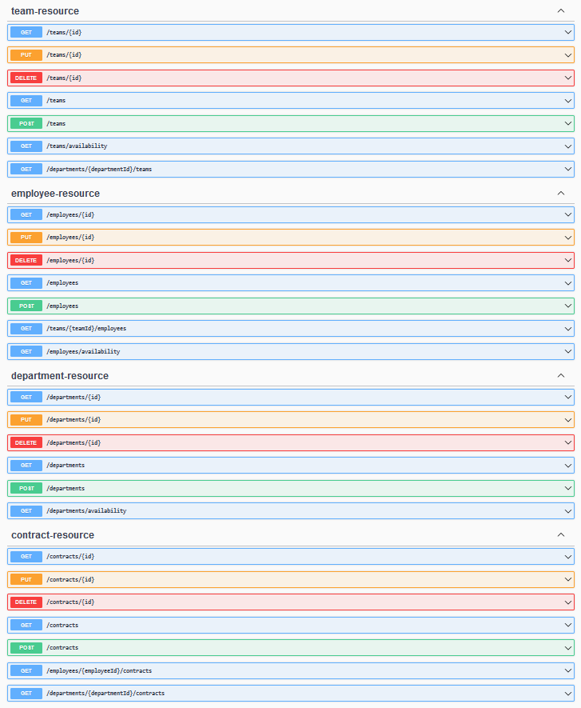

# Stafftool API for managing employees

## Description

REST API for keeping employee records.

## Launch

1. Install Docker
2. Run `docker compose up -d`

OpenAPI specification is available at `/v3/api-docs` or `/swagger-ui/index.html` (Swagger UI)

## Technologies

**Backend**:
- Java 17
- Spring Boot
- Spring Data JPA
- Liquibase
- Java Bean Validation
- OpenAPI
- Mapstruct, Lombok

**Database**:
- PostgreSQL

**DevOps**:
- Docker